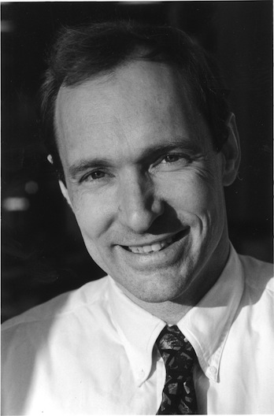

# Who's Who
## Amit Singhal
1. From Indian Origin.
2. Rewrites Google's Page Rank algorithm after Larry, Sergy in 2001.
3. Rewarded "Google Fellow" for the same.

----
## Rasmus Lerdorf, Creator of PHP
1. Created PHP as an alternative way to rewrite scripts over and over for his web development jobs during early 90s and to track visits for his online resume.

----
## Tim Berners Lee. Creator of Hypertext Markup Language when he was working for CERN.

----
## Guido Van Rossum, Creator of Python Programming Language

