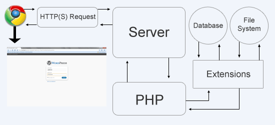

# How PHP Works

#### Intercepts HTTP Request (.php)

#### Pass it on to PHP Module

#### Parsed and executed and output is given to apache server

#### Apache Server handover the generated content along with any other HTML to Client who asked for it.