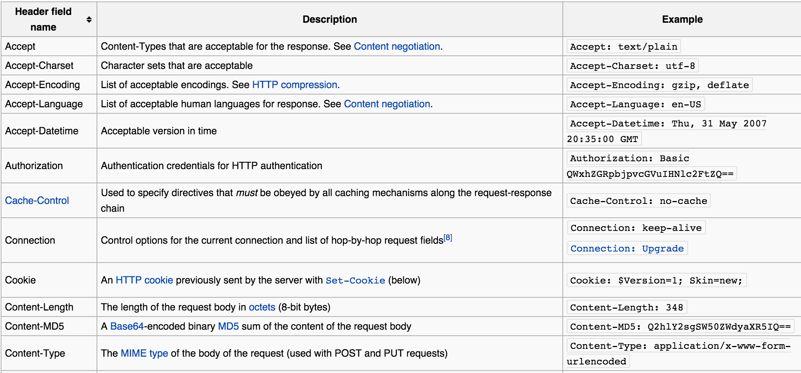
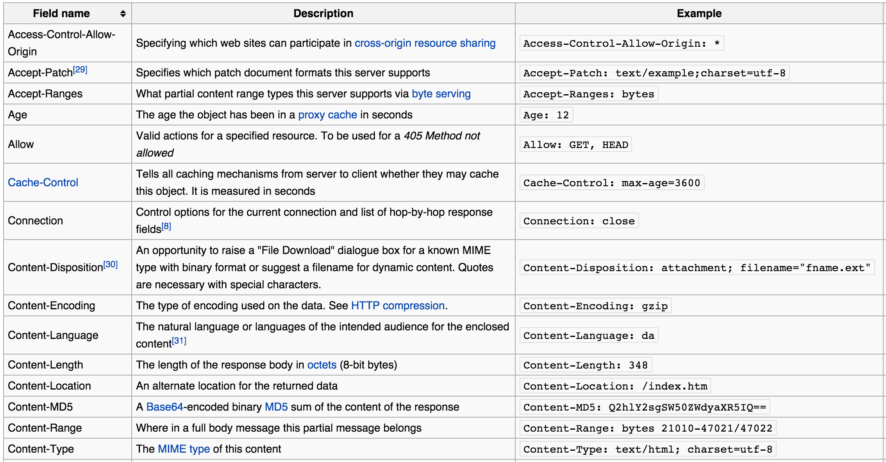

# How Web Works

## HTTP Request

Some Request Headers are

## HTTP Response

## HTTP Status Codes

Status 

1. 2XX -  Success
2. 3XX -  Moved
3. 4XX -  Client Error
4. 5XX -  Server Error

[Complete List](http://www.w3.org/Protocols/rfc2616/rfc2616-sec10.html)
## HTTP is Stateless

### State Management at Client Side - Cookies

### State Management at Server Side - Session